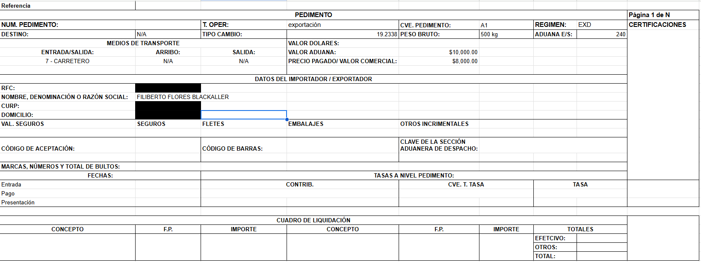

# 🧾 Hermes - AI Customs Pedimento Extractor 🇲🇽

Hermes is an automated system that uses **Gemini AI (Google)** and **Google Apps Script** to extract structured data from Mexican customs documents ("pedimentos") in PDF format. It parses key fields based on **Anexo 22** of the **Reglas Generales de Comercio Exterior** and writes the results into a standardized Google Sheets template.

---

## 🧠 What does Hermes do?

Hermes automatically processes one or more PDFs from a folder in Google Drive, sending them to a local Gemini API for analysis. It returns structured JSON data and writes the key values into a Google Sheet format that resembles the official Mexican customs declaration layout.

Key fields extracted include:

- ✅ Tipo de operación (e.g. exportación)
- ✅ Clave de pedimento (e.g. A1)
- ✅ Régimen aduanero
- ✅ Tipo de cambio
- ✅ Peso bruto
- ✅ Aduana de entrada/salida
- ✅ Valor en dólares, aduana y comercial
- ✅ RFC, CURP, nombre o razón social
- ✅ Domicilio fiscal
- ✅ Medios de transporte: entrada, arribo, salida

---

## 📸 Output Preview

Here’s a real sample of the **Formato Pedimento** automatically populated by Gemini:




## 📚 Legal Reference: Anexo 22

Hermes relies on the field definitions and layout guidance from **Anexo 22** of the **Reglas Generales de Comercio Exterior (RGCE)** issued by the SAT. This annex defines:

- Required fields and their order
- Formats and types (numerical, alphanumeric)
- Operation and regime codes (A1, EXD, etc.)

📖 Learn more: [SAT - Reglas Generales de Comercio Exterior](https://drive.google.com/file/d/1RXPJYHlyFwSeY9gjEkQVmNc9_cYKAcod/view?usp=sharing)

---

## ⚙️ Technologies Used

| Tool / Tech             | Purpose                                       |
|-------------------------|-----------------------------------------------|
| Google Apps Script      | Backend logic, Drive & Sheets integration     |
| Gemini (Google AI)      | Extraction and semantic parsing of PDFs       |
| Google Drive            | Input PDF folder                             |
| Google Sheets           | Output report in customs format               |
| Git & GitHub            | Version control                              |
| `.env`                  | API key handling                             |

---

## 📁 Project Structure

```bash
hermes/
├── .gitignore
├── README.md
├── .env.example              # Environment variable template (not tracked)
├── backend/
│   ├── main.py               # Optional Python script for Gemini interaction
│   └── gemini_response.log   # Example response log
├── hermes-appscript/
│   ├── main.gs               # Main script: sends files to Gemini
│   ├── escribirJSONEnHoja.gs# Writes values into the Google Sheet
│   └── tipoDeCambio.gs       # Handles exchange rate input
├── assets/
│   └── formato_pedimento.png # Sample output screenshot
└── venv/                     # Ignored Python virtual environment
